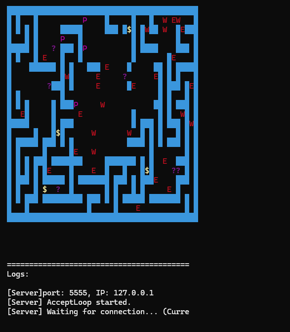

# AetherGrid: RPG following OOD principles

**AetherGrid** is a retro-style, terminal-based multiplayer maze game inspired by classic roguelike adventures. Built for fans of deep, stat-driven gameplay, this game brings a nostalgic dungeon-crawling experience to your screen with complex inventory management, tactical combat, and real-time multiplayer exploration.

I am particulary proud of this game not because of the display style, but the whole system inside utilizing various Design patterns, all of which are explained below.

##  Game Description

In **AetherGrid**, you and other players navigate a massive, grid-based labyrinth filled with hidden treasures and deadly monsters. You must carefully manage your character's stats, equip various weapons and potions, and battle enemies equipped with simple tracking AI. Loot coins and gold ingots, upgrade your gear, and survive the depths!

## Features

* **Multiplayer Maze Exploration**: Connect to a server and navigate the treacherous labyrinth alongside (or against) other players.
* **Deep RPG Stats System**: Characters are defined by core attributes including Strength (STR), Dexterity (DEX), Health Points (HP), Luck (LCK), Aggression (AGG), and Wisdom (WIS).
* **Dynamic Combat & Enemy AI**: Fight a variety of enemies (like Werewolves and Manticores) that utilize simple AI to track and attack players based on their Attack (AT) and Armor (AR) ratings.
* **Advanced Inventory Management**: Equip weapons and items to specific slots (Left Hand / Right Hand). Find, drop, and utilize various item types, including custom-statted weapons and consumable potions.
* **In-Game Economy**: Collect coins and gold ingots scattered throughout the maze to amass wealth.
* **Retro Terminal Interface**: Enjoy a crisp, minimalist ASCII-style interface that puts gameplay and tactical decision-making first.

## 💻 Installation

1. Clone the repository
2. Build the project

## 🕹️ User Manual

### **Getting Started**

1. **Launch the Game**:
* Run the application on multiple instances for multiplayer.
* In exactly one instance, choose **Server Mode** to host the labyrinth. Connect the other instances as clients.

2. **Gameplay Instructions**:
* **Navigate the Labyrinth**: Use the movement keys to explore the maze. Keep an eye on the mini-map to track walls, paths, and points of interest (`$`, `P`, `?`, `E`, `W`, `T`).
* **Manage Gear**: Your survival depends on what you hold. Use the inventory system to equip powerful weapons to your Left or Right hand.
* **Engage in Combat**: Approach enemies to engage them. Your success is calculated based on your equipped items, stats, and the enemy's AT/AR ratings.
* **Loot**: Stand on tiles with items to pick them up and add them to your inventory.

### **Controls**

* **W, S, A, D**: Move your character (Up, Down, Left, Right).
* **Spacebar**: Change active hands.
* **Q**: Enter / Exit the inventory screen.
* **E**: Pick up an item from the current tile.
* **R**: Drop an item from your inventory (if the player is currently in the inventory menu).
* **T**: Drop all items currently held.
* **X**: Unequip an item from the current hand / Equip a selected item from the inventory.

## 🏗️ Design Patterns

*(This section documents the software design patterns implemented in the game's architecture for scalability and maintainability.)*

* **MVC (Model-View-Controller)**: The entire application architecture, for both the client and server, is structured around this pattern. It cleanly separates the internal game state (Model) from the terminal rendering (View) and the logic (Controller).
* **Singleton**: Implemented for the View components on both the client and server. This ensures that only a single, globally accessible instance is allowed to draw to the console, preventing rendering glitches and cursor conflicts.
* **Decorator Pattern**: Utilized to dynamically add and manage attributes for various in-game items (weapons, armor, potions). This allows for flexible, stackable stat modifiers without creating a massive, rigid class hierarchy.
* **Chain of Responsibility (Command Chain)**: Applied to input processing. Player keystrokes are passed along a chain of potential handlers until the appropriate action (movement, combat, inventory management) safely intercepts and executes it.
* **Observer Pattern**: Used for tracking and updating player statistics. The UI and game logic automatically listen and react to changes in the player's core stats (HP, STR, DEX, etc.), ensuring real-time screen updates without tight coupling.
* **Visitor Pattern**: Implemented to handle the complex fight mechanics. It allows the game to execute specific combat logic and stat calculations based on the exact types of entities interacting (e.g., Player vs. Manticore, Player vs. Werewolf) without bloating the entity classes.
* **Builder Pattern**: Employed for procedural world generation. It provides a step-by-step construction process for the intricate labyrinth grids, placing walls, loot, and enemies consistently before finalizing the playable map.